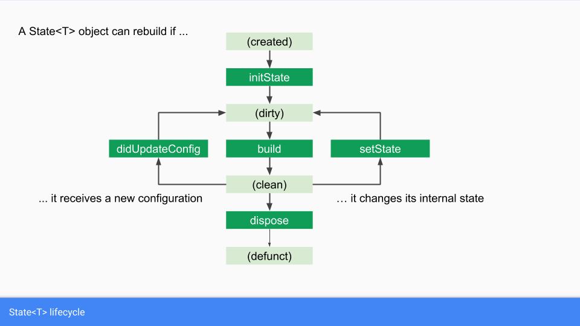

# StatefulWidget, StatelessWidget and InheritedWidget

## 什么是“状态“？

状态就是信息，其中包含了



## “有状态“与“无状态“的区别

Stateful widget和Stateless widget是Flutter widget中的基本概念。

简单来讲，如果一个widget需要在**实例化后管理内部状态**，那这个widget就应该是stateful，即有状态的。例如checkbox就包含“选中”与“非选中”两种状态，而我们并不希望因为用户改变了checkbox的状态就重绘整个widget甚至整个界面。而Stateless widget仅能在每次实例化的时候基于传入的参数绘制widget，以后如果需要改变则需要重新实例化该widget。StatelessWidget适用于仅用做信息展示而无需用户交互的widget。

这里给出原生Stateful和Stateless widget的列表供参考

### 原生Stateful widget

### 原生Stateless widget

## Stateless widget

### 原理

### 要点概述

### 

### 示例代码

## Stateful Widget

### 原理

> State is information that \(1\) can be read synchronously when the widget is built and \(2\) might change during the lifetime of the widget. It is the responsibility of the widget implementer to ensure that the [State](https://docs.flutter.io/flutter/widgets/State-class.html) is promptly notified when such state changes, using [State.setState](https://docs.flutter.io/flutter/widgets/State/setState.html).


### 要点概述

> * 与Stateless Widget只需实现一个类不同，要实现一个Stateful Widget需要创建两个类，分别继承自**StatefulWidget**和**State**。
> * StatefulWidget封装widget对外的调用方法，而State类管理widget内部状态以及重绘方法，即build\(\)方法。
> * StateWidget实例化时调用**createState\(\)**方法进行widget初始化，当widget状态变化时，state对象调用**setState\(\)**方法来通知框架重绘widget。

### 示例代码

```dart
class MyStatefulWidget extends StatefulWidget {
    @override
    _MyStatefulWidget createState() => _MyStatefulWidget();
}

class _MyStatefulWidget extends State<MyStatefulWidget> {
    //这是内部逻辑处理函数，关键在于其中对setState的调用部分。
    //如果仅修改state而不调用该方法，widget并不会刷新
    void _doSomething(){
        setState(){
                //在这里改变widget的状态，并且框架会在setState执行完毕后触发widget重绘
            }
    }
    
    @override
    Widget build(BuildContext context) {
        //在这里放置widget内容生成代码
        //...
        //当widget中特定行为发生时，调用setState来修改widget内容，例如
        IconButton(
            icon: (_isFavorited
            ? Icon(Icons.star)
            : Icon(Icons.star_border)),
            color: Colors.red[500],
            onPressed: _doSomething,
        )
    }
}
```

## 如何选择？

### 根据状态管理方式

很多时候我们会发现混淆的地方，特别是当自定义widget中存在一种层次解构的时候。例如如果我们要做一个会员卡widget A，但是其中又要嵌入一个自定义图表widget B，其可在条状图和饼状图间进行切换来显示会员消费趋势和比例。

选择的依据在于“谁会来管理widget的状态？是widget 自己还是其父widget？“

* 如果widget自己会管理状态，例如在B中包含来一个switch widget，那B就应该是**有状态**的，A就可以是**无状态**的；
* 如果widget状态由父widget管理，例如B仅是一个图表widget，而switch开关在A上。那B就是**无状态**，而A则是**有状态**的。

这里有三个例子，示范三种不同的状态管理实现方式。

#### 由子widget自己管理状态

```dart
// WidgetA由自己管理状态
 
//------------------------- WidgetA ----------------------------------
 
class WidgetA extends StatefulWidget {
    WidgetA({Key key}) : super(key: key);
     
    @override
    _WidgetAState createState() => _WidgetAState();
}
 
class _WidgetAState extends State {
    bool _active = false;
     
    void _doTap() {
        setState(() {
            _active = !_active;
        });
    }
 
    Widget build(BuildContext context) {
        return GestureDetector(
            onTap: _doTap,
            child: Container(
                child: Center(
                    child: Text(
                        _active ? 'Active' : 'Inactive',
                        style: TextStyle(fontSize: 32.0, color: Colors.white),
                    ),
                ),
                width: 200.0,
                height: 200.0,
                decoration: BoxDecoration(
                    color: _active ? Colors.lightGreen[700] : Colors.grey[600],
                ),
            ),
        );
    }
}
 
//------------------------- MyApp ----------------------------------
 
class MyApp extends StatelessWidget {
    @override
    Widget build(BuildContext context) {
        return MaterialApp(
        title: 'Flutter Demo',
        home: Scaffold(
            appBar: AppBar(
                title: Text('Flutter Demo'),
            ),
            body: Center(
                child: WidgetA(),
            ),
        ),
    );
}
```

#### 由父widget管理状态

```dart
// ParentWidget manages the state for TapboxB.
 
//------------------------ ParentWidget --------------------------------
 
class ParentWidget extends StatefulWidget {
    @override
    _ParentWidgetState createState() => _ParentWidgetState();
    }
     
    class _ParentWidgetState extends State {
        bool _active = false;
         
        void _handleTapboxChanged(bool newValue) {
            setState(() {
            _active = newValue;
        });
    }
 
    @override
    Widget build(BuildContext context) {
        return Container(
            child: TapboxB(
                active: _active,
                onChanged: _handleTapboxChanged,
            ),
        );
    }
}
 
//------------------------- WidgetB ----------------------------------
 
class WidgetB extends StatelessWidget {
    WidgetB({Key key, this.active: false, @required this.onChanged})
    : super(key: key);
     
    final bool active;
    final ValueChanged onChanged;
     
    void _doTap() {
        onChanged(!active);
    }
     
    Widget build(BuildContext context) {
        return GestureDetector(
            onTap: _doTap,
            child: Container(
                child: Center(
                    child: Text(
                        active ? 'Active' : 'Inactive',
                        style: TextStyle(fontSize: 32.0, color: Colors.white),
                    ),
                ),
                width: 200.0,
                height: 200.0,
                decoration: BoxDecoration(
                color: active ? Colors.lightGreen[700] : Colors.grey[600],
                ),
            ),
        );
    }
}
```

#### 混合模式，父子widget分别管理不同的状态

```dart
//---------------------------- ParentWidget ----------------------------
 
class ParentWidget extends StatefulWidget {
    @override
    _ParentWidgetState createState() => _ParentWidgetState();
    }
     
    class _ParentWidgetState extends State {
        bool _active = false;
         
        void _handleTapboxChanged(bool newValue) {
            setState(() {
            _active = newValue;
        });
    }
     
    @override
    Widget build(BuildContext context) {
        return Container(
            child: TapboxC(
                active: _active,
                onChanged: _handleTapboxChanged,
            ),
        );
    }
}
 
//----------------------------- TapboxC ------------------------------
 
class TapboxC extends StatefulWidget {
    TapboxC({Key key, this.active: false, @required this.onChanged})
    : super(key: key);
     
    final bool active;
    final ValueChanged onChanged;
     
    _TapboxCState createState() => _TapboxCState();
}
 
class _TapboxCState extends State {
    bool _highlight = false;
     
    void _handleTapDown(TapDownDetails details) {
        setState(() {
            _highlight = true;
        });
    }
     
    void _handleTapUp(TapUpDetails details) {
        setState(() {
            _highlight = false;
        });
    }
     
    void _handleTapCancel() {
        setState(() {
            _highlight = false;
        });
    }
 
    void _handleTap() {
        widget.onChanged(!widget.active);
    }
 
    Widget build(BuildContext context) {
        // This example adds a green border on tap down.
        // On tap up, the square changes to the opposite state.
        return GestureDetector(
            onTapDown: _handleTapDown, // Handle the tap events in the order that
            onTapUp: _handleTapUp, // they occur: down, up, tap, cancel
            onTap: _handleTap,
            onTapCancel: _handleTapCancel,
            child: Container(
                child: Center(
                    child: Text(
                        widget.active ? 'Active' : 'Inactive',
                        style: TextStyle(fontSize: 32.0, color: Colors.white)),
                    ),
                    width: 200.0,
                    height: 200.0,
                    decoration: BoxDecoration(
                        color:
                        widget.active ? Colors.lightGreen[700] : Colors.grey[600],
                        border: _highlight
                        ? Border.all(
                            color: Colors.teal[700],
                            width: 10.0,
                        )
                        : null,
                ),
            ),
        );
    }
}
```

### 基于性能考量依据

#### Stateless Widget

The [build](https://docs.flutter.io/flutter/widgets/StatelessWidget/build.html) method of a stateless widget is typically only called in three situations: the first time the widget is inserted in the tree, when the widget's parent changes its configuration, and when an [InheritedWidget](https://docs.flutter.io/flutter/widgets/InheritedWidget-class.html) it depends on changes.

If a widget's parent will regularly change the widget's configuration, or if it depends on inherited widgets that frequently change, then it is important to optimize the performance of the [build](https://docs.flutter.io/flutter/widgets/StatelessWidget/build.html) method to maintain a fluid rendering performance.

There are several techniques one can use to minimize the impact of rebuilding a stateless widget:

* Minimize the number of nodes transitively created by the build method and any widgets it creates. For example, instead of an elaborate arrangement of [Row](https://docs.flutter.io/flutter/widgets/Row-class.html)s, [Column](https://docs.flutter.io/flutter/widgets/Column-class.html)s, [Padding](https://docs.flutter.io/flutter/widgets/Padding-class.html)s, and [SizedBox](https://docs.flutter.io/flutter/widgets/SizedBox-class.html)es to position a single child in a particularly fancy manner, consider using just an [Align](https://docs.flutter.io/flutter/widgets/Align-class.html) or a[CustomSingleChildLayout](https://docs.flutter.io/flutter/widgets/CustomSingleChildLayout-class.html). Instead of an intricate layering of multiple [Container](https://docs.flutter.io/flutter/widgets/Container-class.html)s and with [Decoration](https://docs.flutter.io/flutter/painting/Decoration-class.html)s to draw just the right graphical effect, consider a single [CustomPaint](https://docs.flutter.io/flutter/widgets/CustomPaint-class.html) widget.
* Use `const` widgets where possible, and provide a `const` constructor for the widget so that users of the widget can also do so.
* Consider refactoring the stateless widget into a stateful widget so that it can use some of the techniques described at [StatefulWidget](https://docs.flutter.io/flutter/widgets/StatefulWidget-class.html), such as caching common parts of subtrees and using [GlobalKey](https://docs.flutter.io/flutter/widgets/GlobalKey-class.html)s when changing the tree structure.
* If the widget is likely to get rebuilt frequently due to the use of [InheritedWidget](https://docs.flutter.io/flutter/widgets/InheritedWidget-class.html)s, consider refactoring the stateless widget into multiple widgets, with the parts of the tree that change being pushed to the leaves. For example instead of building a tree with four widgets, the inner-most widget depending on the [Theme](https://docs.flutter.io/flutter/material/Theme-class.html), consider factoring out the part of the build function that builds the inner-most widget into its own widget, so that only the inner-most widget needs to be rebuilt when the theme changes.

#### Stateful Widget

There are two primary categories of [StatefulWidget](https://docs.flutter.io/flutter/widgets/StatefulWidget-class.html)s.

The first is one which allocates resources in [State.initState](https://docs.flutter.io/flutter/widgets/State/initState.html) and disposes of them in [State.dispose](https://docs.flutter.io/flutter/widgets/State/dispose.html), but which does not depend on [InheritedWidget](https://docs.flutter.io/flutter/widgets/InheritedWidget-class.html)s or call [State.setState](https://docs.flutter.io/flutter/widgets/State/setState.html). Such widgets are commonly used at the root of an application or page, and communicate with subwidgets via [ChangeNotifier](https://docs.flutter.io/flutter/foundation/ChangeNotifier-class.html)s, [Stream](https://docs.flutter.io/flutter/dart-async/Stream-class.html)s, or other such objects. Stateful widgets following such a pattern are relatively cheap \(in terms of CPU and GPU cycles\), because they are built once then never update. They can, therefore, have somewhat complicated and deep build methods.

The second category is widgets that use [State.setState](https://docs.flutter.io/flutter/widgets/State/setState.html) or depend on [InheritedWidget](https://docs.flutter.io/flutter/widgets/InheritedWidget-class.html)s. These will typically rebuild many times during the application's lifetime, and it is therefore important to minimize the impact of rebuilding such a widget. \(They may also use [State.initState](https://docs.flutter.io/flutter/widgets/State/initState.html) or [State.didChangeDependencies](https://docs.flutter.io/flutter/widgets/State/didChangeDependencies.html) and allocate resources, but the important part is that they rebuild.\)

There are several techniques one can use to minimize the impact of rebuilding a stateful widget:

* Push the state to the leaves. For example, if your page has a ticking clock, rather than putting the state at the top of the page and rebuilding the entire page each time the clock ticks, create a dedicated clock widget that only updates itself.
* Minimize the number of nodes transitively created by the build method and any widgets it creates. Ideally, a stateful widget would only create a single widget, and that widget would be a [RenderObjectWidget](https://docs.flutter.io/flutter/widgets/RenderObjectWidget-class.html). \(Obviously this isn't always practical, but the closer a widget gets to this ideal, the more efficient it will be.\)
* If a subtree does not change, cache the widget that represents that subtree and re-use it each time it can be used. It is massively more efficient for a widget to be re-used than for a new \(but identically-configured\) widget to be created. Factoring out the stateful part into a widget that takes a child argument is a common way of doing this.
* Use `const` widgets where possible. \(This is equivalent to caching a widget and re-using it.\)
* Avoid changing the depth of any created subtrees or changing the type of any widgets in the subtree. For example, rather than returning either the child or the child wrapped in an [IgnorePointer](https://docs.flutter.io/flutter/widgets/IgnorePointer-class.html), always wrap the child widget in an [IgnorePointer](https://docs.flutter.io/flutter/widgets/IgnorePointer-class.html) and control the [IgnorePointer.ignoring](https://docs.flutter.io/flutter/widgets/IgnorePointer/ignoring.html) property. This is because changing the depth of the subtree requires rebuilding, laying out, and painting the entire subtree, whereas just changing the property will require the least possible change to the render tree \(in the case of [IgnorePointer](https://docs.flutter.io/flutter/widgets/IgnorePointer-class.html), for example, no layout or repaint is necessary at all\).
* If the depth must be changed for some reason, consider wrapping the common parts of the subtrees in widgets that have a [GlobalKey](https://docs.flutter.io/flutter/widgets/GlobalKey-class.html) that remains consistent for the life of the stateful widget. \(The[KeyedSubtree](https://docs.flutter.io/flutter/widgets/KeyedSubtree-class.html) widget may be useful for this purpose if no other widget can conveniently be assigned the key.\)

## 参考来源







